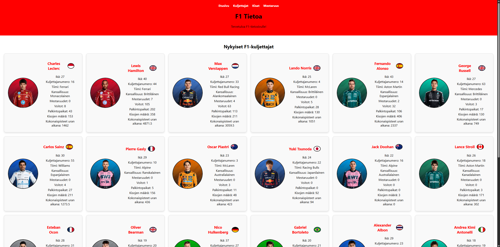

# Vaihe 3 Projektin Jatkokehitys

## Jatkokehityksen Idea
Jatkokehityksessä halusin laajentaa tietojen määrää, mitä nettisivulta voi löytää. Tavoitteena oli tarjota käyttäjille enemmän ja monipuolisempaa tietoa F1-kisoista ja kuljettajista. Halusin myös parantaa nettisivun ulkoasua ja käytettävyyttä, jotta sivusto olisi visuaalisesti miellyttävämpi ja helpompi navigoida. Erityisesti halusin parantaa kuljettajasivun ulkoasua, sillä vaiheessa 2 en onnistunut saamaan erillistä sivua toimimaan jokaiselle kuljettajalle. Tämän vuoksi päätin muuttaa sivun ulkoasua ja rakennetta parempaan suuntaan.
## Jatkokehitys
Lisäsin muutaman uuden SQLite-tietokannan, joihin tallensin F1-viikonloppujen aika-ajot ja harjoitussessiot. Lisäksi lisäsin yhden SQLite-tietokannan, jossa on tallien mestaruudet tältä vuodelta. Näiden tietokantojen avulla käyttäjät voivat nyt tarkastella yksityiskohtaisempia tietoja kisoista ja tallien suorituksista. Parantelin myös näiden taulukoiden tyyliä hieman App.css-tiedostossa, jotta taulukot olisivat hieman isompia ja helpompia lukea.
Lisäsin Kisat ja Mestaruudet -välilehteen dropdown-menut, joiden avulla käyttäjät voivat helposti valita haluamansa välilehden pitämällä hiirtä tekstin päällä. Tämä parantaa sivuston käytettävyyttä ja tekee navigoinnista sujuvampaa. Lisäsin myös napit sivulle, jotta käyttäjät voivat vaihtaa välilehteä ilman, että heidän tarvitsee aina avata dropdown-menua.

Kuskit-välilehdessä tein merkittävän päivityksen. Aiemman kuljettajataulukon sijaan loin jokaiselle kuljettajalle oman laatikkonsa Driverlist.css-tiedoston avulla, jossa määritellään, miltä Kuskit-välilehti näyttää. Lisäsin jokaiselle kuljettajalle kuvan ja lipun, jotta sivu olisi visuaalisesti houkuttelevampi ja informatiivisempi. Päivitin myös kuljettajatietokannan tiedot olemaan tarkempia ja ajantasaisempia. Poistin vanhasta tietokannasta muutamia tietoja ja lisäsin uusia, kuten kuljettajanumeron. Lisäksi lisäsin tietokantaan kuvien nimet, jotta Driverchart.js-tiedosto voi hakea ja näyttää oikeat kuvat.

