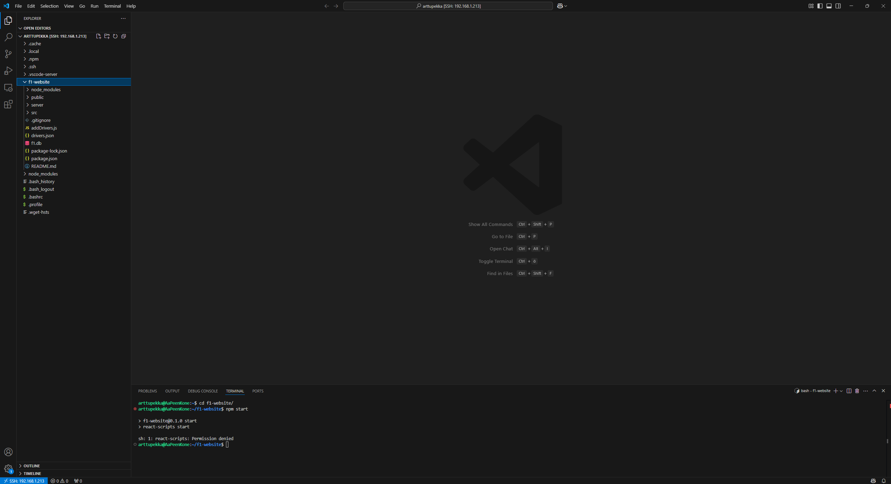

# Vaihe 2 Perusrakenne ja Päätoiminnallisuudet

## Ympäristö
Projektia olen kehittänyt käyttämällä Visual Studio Codea. Tällä hetkellä projekti on paikallisella tietokoneella ja GitHub-repositoriossa.

Nettisivu on paikallisella virtuaalikoneella, mutta siinä on joitakin ongelmia, koska en saa kopiota joistakin tiedostoista node_modules-kansiossa.

## Backend
Backendissä käytän SQLite-tietokantaa, johon olen luonut taulut kuljettajille, kisoille, mestaruuksille ja palautteelle. Käytän Express.js:ää palvelimen luomiseen, joka tarjoaa REST API -rajapinnan tietojen hakemiseen ja palautteen lähettämiseen.

## Frontend
Frontendissä nettisivu on rakennettu käyttäen Reactia. Käytin komennon npx create-react-app luodakseni React-applikaation, jonka ympärille aloin rakentaa nettisivua. Navigaatio on toteutettu React Routerilla, ja sivut sisältävät komponentteja, kuten kuljettajalista, kisalista ja mestaruuslista.

## Tietokanta
Tietokantana käytän SQLite-pohjaista f1.db-tietokantaa, johon tallennan tiedot, kuten kuljettajien saavutukset ja kisatulokset. 

Tietokannan täyttöön käytän JavaScript-tiedostoja, jotka lisäävät tiedot tietokantaan JSON-tiedostosta.

Yllä oleva kuva on yksi tiedostoista, joka lisää tietoja f1.db tietokantaan

## Perusrakenne ja arkkitehtuuri
Nettisivu on rakennettu Reactin päälle. Etusivua varten minulla on tiedosto Home.js, joka määrittelee etusivun sisällön. Jokaista välilehteä varten on omat tiedostonsa, kuten DriverChart.js, RaceList.js ja ChampionShipList.js. App.js määrittelee polut kaikille komponenteille, ja App.css-tiedostossa määrittelen sivun tyylin ja värit. 

## Toiminnallisuudet
Nettisivun päätoiminnallisuuksiin kuuluu palautelaatikko, johon voi kirjoittaa palautetta, sekä linkit muille nettisivuille, kuten F1 Wikipedia ja F1 virallinen nettisivu. Käyttäjä voi myös tarkastella kuljettajien tietoja painamalla heidän nimiään välilehdellä Kuskit, jolloin nettisivu aukaisee kuljettajan tiedot erilliselle sivulle.

## Koodin laatu ja Dokumentointi
Olen käyttänyt Copilotia apuna tässä projektissa. Koodi on jaettu moniin tiedostoihin, joista jokainen määrittelee oman välisivunsa. Dokumentointiin minulla on kansio Projektin vaiheet ja tiedosto README.md.

## Testaaminen ja Virheiden hallinta
Sivulla on palauteosio, jossa käyttäjä voi lähettää palautetta lomakkeen kautta. Lomake on toteutettu Reactilla, ja siinä käytetään useState-hookia tiedon hallintaan. Pyyntö on suojattu try-catch-rakenteella, jolla mahdolliset virheet kaapataan ja tulostetaan konsoliin. Käytän myös required-attribuuttia varmistaakseni, ettei lomake lähde tyhjänä.

## UI ja UX
Käyttöliittymän UI:ta määrittelen app.css-tiedostolla. Sivustolla käytän selviä värejä: valkoista, punaista ja mustaa, jotka ovat Formula 1 -sarjan keskusvärit. Navigaatio-osiossa käytän punaisella pohjalla olevia valkoisia nappeja, ja kun hiiri on napin päällä, kyseiseen kohtaan tulee alaviiva, jotta näkyy selvästi, mitä olet valitsemassa. Käytän myös hover-efektejä, joiden avulla napit muuttuvat punaiseksi mustasta, kun niiden päällä on hiiri.