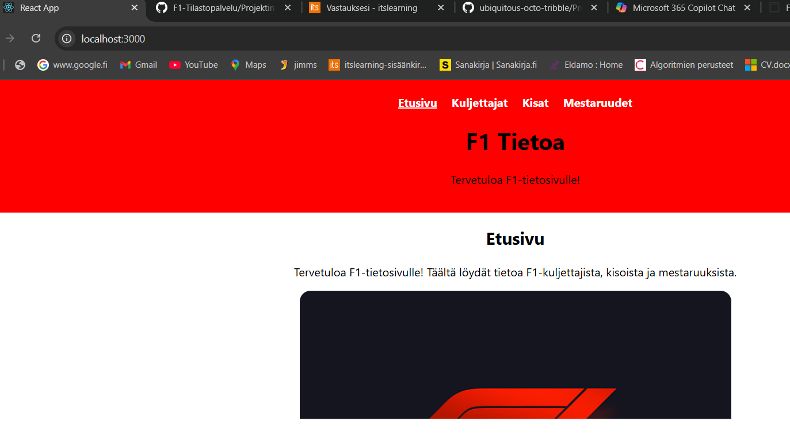
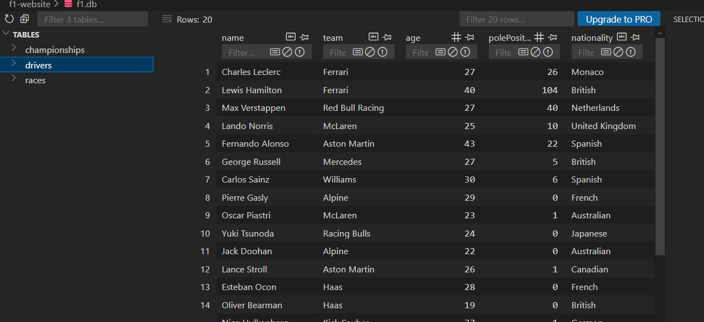
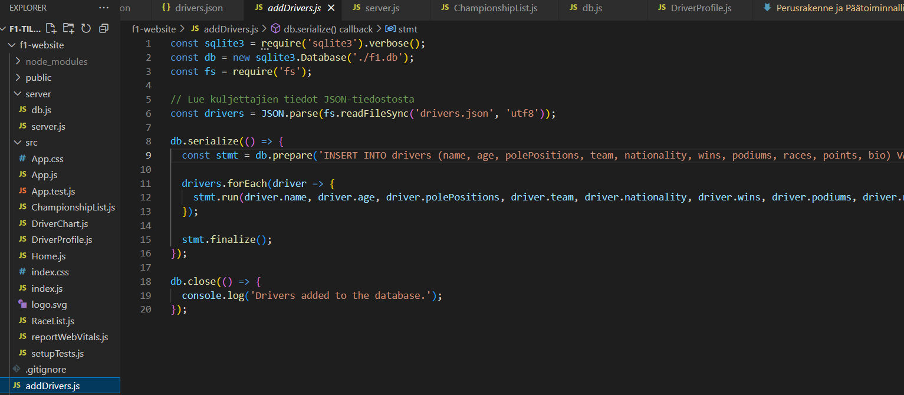

# Vaihe 2 Perusrakenne ja Päätoiminnallisuudet

## Ympäristö

## Backend

## Frontend
Frontendsissä nettisivu on rakennettu Reactia käyttäen, joten käytin jo sivun tekiessä komennon, jolla luodaan React-appi npx create-react-app f1-website. Ja sen jälkeen aloin rakentaa nettisivua Reactin ympärille. Seuraavassa kuvassa vielä näkyy, että tässä lukee Reactapp. 

## Tietokanta
Tässä vaiheessa käytän tietokantaa SQLite pohjautunutta tietokantaa f1.db, johon laitan tiedot kuten Drivers tietokanta, jossa on kaikkien tämän hetkisten F1-kuskien saavutukset kuten voittojen määrä, palkintopaikkojen määrä ja niin edespäin. Alla on kuva tietokannan sisällöstä.

Kyseinen SQLite tietokanta näyttää seuraavalta kuvalta nettisivulla.

Tietokannan täyttöön tein tiedoston addDrivers.js ja drivers.json jotta pystyisin yhdellä komennolla täyttää koko tietokannan täyteen kerralla.

Kyseinen tiedosto suorittaa komennon, joka lisää tiedot f1.db tietokantaan, jokaiselle tiedolle mikä on tiedostossa drivers.json
## Perusrakenne ja arkkitehtuuri

## Toiminnallisuudet
Nettisivun päätoiminnaliisuksiin tällä hetkellä kuuluu palautelaatikko, johon voi kirjoittaa palautetta ja muutama linkki joista voi mennä muille nettisivuille kuten F1 Wikipedia ja F1 virallinen nettisivu. Toiminnallisuuteen myös käyttäessä kuskit SQLite taulukossa painaessa kuskien nimiä välilehdellä Kuskit, Nettisivu aukaisee kuskin tiedot erillisille sivulle ja taulukolla joka on sivulla kuskit näkyy vain osa kuskien tiedoista. 

## Koodin laatu ja Dokumentointi

## Testaaminen ja Virheiden hallinta

## UI ja UX

