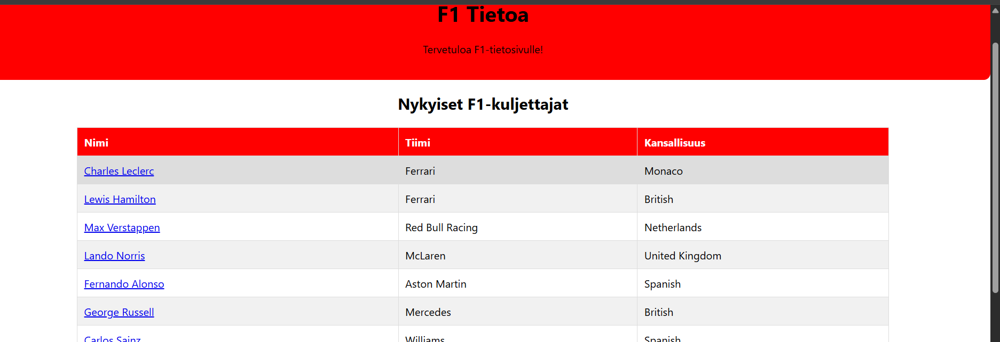

# Vaihe 2 Perusrakenne ja Päätoiminnallisuudet

## Ympäristö
Projektia olen kehittänyt käyttämällä Visual Studio Codea. Tällä hetkellä Projekti on paikallisella tietokoneella ja Github repositoriossa. Aion siirtää projektini paikalliseen Virtuaali koneeseen, On Premise Debianiin, jossa sitten pitäisin nettisivun, kun esittelen tämän projektin videolla.
## Backend

## Frontend
Frontendsissä nettisivu on rakennettu Reactia käyttäen, joten käytin jo sivun tekiessä komennon, jolla luodaan React-appi npx create-react-app f1-website. Ja sen jälkeen aloin rakentaa nettisivua Reactin ympärille. Seuraavassa kuvassa vielä näkyy, että tässä lukee Reactapp. 

## Tietokanta
Tässä vaiheessa käytän tietokantaa SQLite pohjautunutta tietokantaa f1.db, johon laitan tiedot kuten Drivers tietokanta, jossa on kaikkien tämän hetkisten F1-kuskien saavutukset kuten voittojen määrä, palkintopaikkojen määrä ja niin edespäin. Alla on kuva tietokannan sisällöstä.

Kyseinen SQLite tietokanta näyttää seuraavalta kuvalta nettisivulla.

Tietokannan täyttöön tein tiedoston addDrivers.js ja drivers.json jotta pystyisin yhdellä komennolla täyttää koko tietokannan täyteen kerralla.

Kyseinen tiedosto suorittaa komennon, joka lisää tiedot f1.db tietokantaan, jokaiselle tiedolle mikä on tiedostossa drivers.json
## Perusrakenne ja arkkitehtuuri
Rakenteena minulla on nettisivu rakennettu Reactin päälle. Etusivua varten minulla on kansiossa src tiedosto Home.js, jossa määritellään mitä nettisivun etusivulla on. 
Jokaista välilehteä varten nettisivulla minulla on omatiedostonsa DriverChart.js, RaceList.js ja ChampionShipList.js.
App.js määrittelee polut kaikille muille komponenteille nettisivullani. App.css tiedostossa määrittelen nettisivuni tyylin ja päävärit punainen, valkoinen ja musta nettisivullani.
## Toiminnallisuudet
Nettisivun päätoiminnaliisuksiin tällä hetkellä kuuluu palautelaatikko, johon voi kirjoittaa palautetta ja muutama linkki joista voi mennä muille nettisivuille kuten F1 Wikipedia ja F1 virallinen nettisivu. Toiminnallisuuteen myös käyttäessä kuskit SQLite taulukossa painaessa kuskien nimiä välilehdellä Kuskit, Nettisivu aukaisee kuskin tiedot erillisille sivulle ja taulukolla joka on sivulla kuskit näkyy vain osa kuskien tiedoista. 

## Koodin laatu ja Dokumentointi
Olen käyttänyt CoPilottia apuna tässä Projektissa tähän asti, koska itse en osaisi aivan täysin tehdä näitä täysin ilman mitään apua. Koodi on jaettu moniin tiedostoihin, joista jokainen määrittelee oman välisivunsa. Minulla tiedostot Home.js, RaceList.js ja muut, että koodi pysyy siistinä.
Olen myös tehnyt itselleni tiedostoja, joita Noden avulla ajamalla voin käyttää f1.db tietokantaani, että minun erikseen ei tarvitse mennä tekemään kaikki komennot erikseen SQLite komento rivillä.
Dokumentointiin minulla on kansio Projektin vaiheet ja tiedosto README.md
## Testaaminen ja Virheiden hallinta
Sivulla on palauteosio, jossa käyttäjä voi lähettää palautetta lomakkeen kautta. Lomake on toteutettu Reactilla, ja siinä käytetään useState-hookia tiedon hallintaan. Kun käyttäjä lähettää palautteen, data lähetetään backendille fetch-pyynnöllä. Pyyntö on suojattu try-catch-rakenteella, jolla mahdolliset virheet kaappautuvat ja tulostuvat konsoliin. Jos palautteen lähetys onnistuu, käyttäjälle näytetään kiitosviesti.

Käytän myös required-attribuuttia varmistaakseni, ettei lomake lähde tyhjänä. Tämä on osa käyttöliittymän testausta ja virheiden hallintaa.
## UI ja UX
Käyttöliittymän UI:ta määrittelen app.css tiedostolla. Sivustolla käytän Selviä värejä Valkoista, Punaista ja Mustaa jotka ovat Formula 1 sarjan keskusvärit. Navigointi osiossa käytän punaisella pohjalla olevia valkoisia nappeja, ja kun hiiri on napin päällä kyseiseen kohtaan tulee alaviiva, että siinä näkyy selvästi minkä olet valitsemassa.
Käytän myös Hover-effektejä joiden avulla napit, joilla on eri toimintoja. Nämä napit muuttuvat punaiseksi mustasta, kun niitten päällä on hiiri ja tämä toimii visuaalisena palautteena nettisivun käyttäjälle.
Käyttöliittymän olen rakentanut selkeästi: navigointi on ylhäällä, sisältö keskitettynä, ja tiedot esitetään esimerkiksi taulukoissa, jotka ovat helposti silmäiltävissä. 
Tästä kaikesta on apua hyvässä käyttäjäkokemusta, sillä käyttäjä löytää tarvitsemansa tiedot vaivattomasti ja nopeasti.